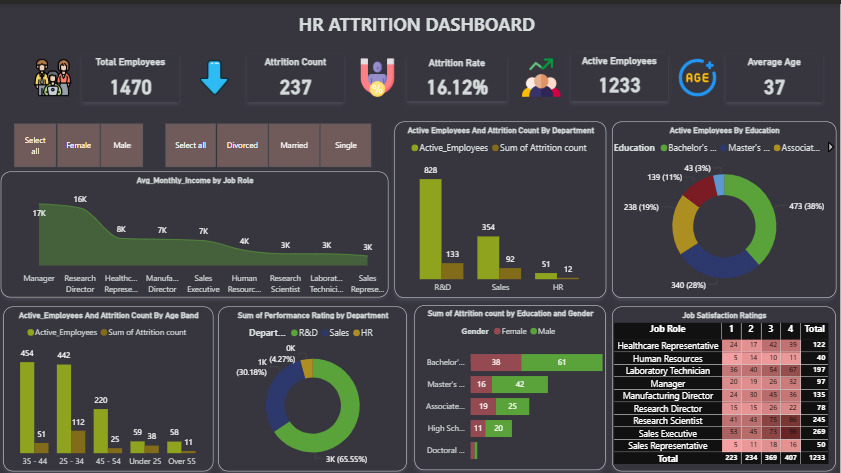

# 📊 HR Attrition Dashboard – Power BI  

## 📌 Project Overview  
This project is an **HR Analytics Dashboard** created in **Power BI** to analyze employee attrition (resignations/turnover).  
The report highlights how different factors—such as **age, gender, education, department, job role, and performance rating**—influence attrition.  

The goal is to provide **data-driven insights** that HR teams can use to improve employee retention.  

---

## 🎯 Key Metrics  
- **Total Employees:** 1470  
- **Attrition Count:** 237  
- **Attrition Rate:** 16.12%  
- **Active Employees:** 1233  
- **Average Age:** 37 years  

---

## 🔎 Insights from Dashboard  
- Employees aged **25–34** show the highest attrition.  
- **R&D department** has the highest turnover.  
- **Managers and Research Directors** leave despite higher salaries.  
- Employees with **Bachelor’s degrees** are more likely to leave.  
- **Male attrition** is slightly higher than female.  

---

## 📊 Dashboard Preview  
  

---

## 🛠 Tools & Technologies  
- **Power BI Desktop** – Dashboard building  
- **Excel Dataset** – (Not uploaded, internal HR sample dataset)  
- **DAX (Data Analysis Expressions)** – Custom measures and KPIs  

---

## 🚀 How to Explore  
1. Download this repository.  
2. Open **`HR_Attrition.pbix`** in **Power BI Desktop**.  
3. Replace or connect to your own HR dataset if needed.  

---

## 🙌 Acknowledgements  
- Dataset: HR Analytics sample dataset (used for learning/demo)  
- Dashboard created in **Power BI Desktop**  

